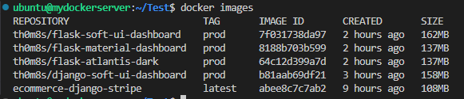
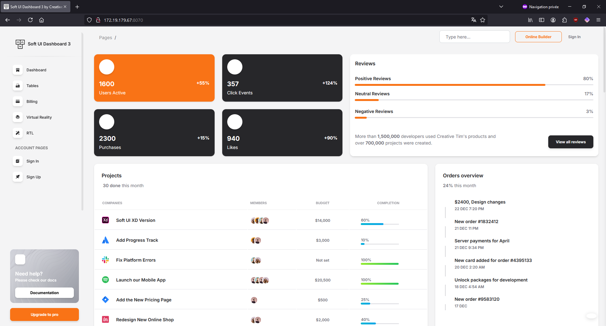
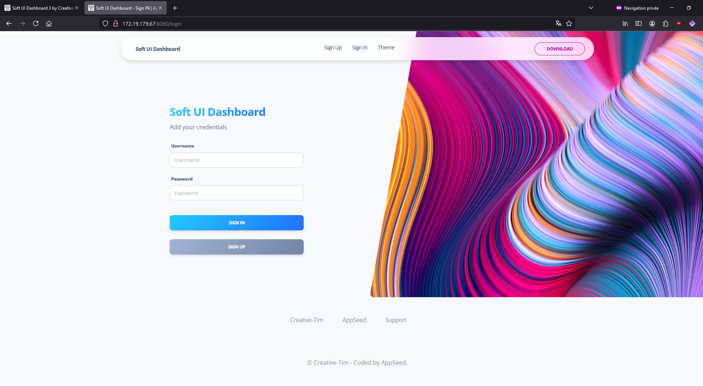
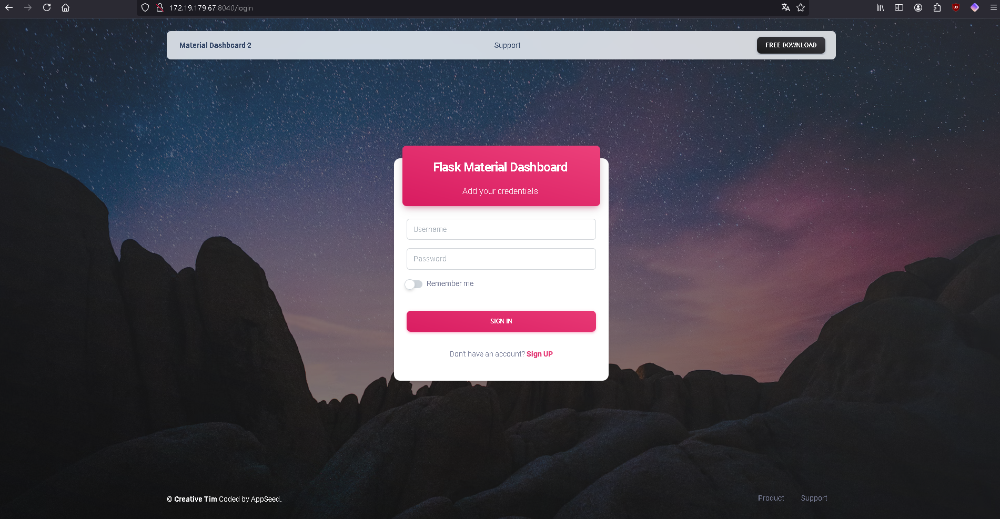
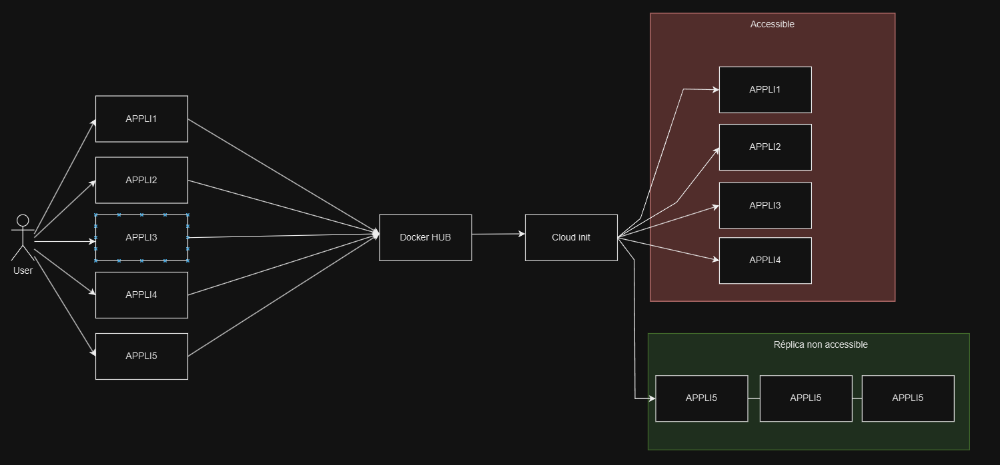

# E5-CCISP
Djamel MOAD Rendue 


<!-- PROJECT LOGO --> <br /> <div align="center"> <h3 align="center">Projet Docker : Applications Web</h3> <p align="center"> 
<a href="https://github.com/app-generator/django-soft-ui-dashboard"><strong>Documentation Django Soft UI Dashboard </strong></a> <br /> 
<a href="https://github.com/app-generator/flask-soft-ui-design">Documentation Flask Soft UI Design</a> · 
<a href="https://github.com/app-generator/ecommerce-flask-stripe">Documentation Ecommerce Flask Stripe</a> · 
<a href="https://github.com/app-generator/flask-material-dashboard.git">Documentation Flask Material DashBoard</a> </p> </div>

<!-- TABLE OF CONTENTS --> <details> <summary>Table des matières</summary> <ol> <li><a href="#structure-du-projet">Structure du projet</a></li> <li><a href="#configurations">Configurations</a></li> 
<li><a href="#etape-du-build">Étape du build</a></li> <li><a href="#logs">Logs</a></li> <li><a href="#quelques-interfaces">Quelques Interfaces</a></li> </ol> </details>


<!-- ABOUT THE PROJECT -->
## Struture du projet

Voici la structure du projet:

```bash
< PROJECT ROOT >
   |
   |-- apps/
   |    |-- django-soft-ui-dashboard/
   |    |-- flask-soft-ui-design/
   |    |-- ecommerce-flask-stripe/
   |    |-- rocket-django/
   |
   |-- nginx/
   |    |-- nginx.conf
   |
   |-- docker-compose.yml
   ************************************************************************
```


<p align="right">(<a href="#readme-top">back to top</a>)</p>

<!-- FILES CONFIGURATIONS -->
## Configurations

. Contenu du docker-compose.yml

``` bash
version: '3.7'

services:
  django-soft-ui:
    # build: ./django-soft-ui-dashboard
    image: th0m8s/django-soft-ui-dashboard:prod
    ports:
"5080:5005"
networks:
app_network

  flask-soft-ui:
    # build: ./apps/flask-soft-ui-design
    image: th0m8s/flask-soft-ui-dashboard:prod
    ports: 
      
"5083:5008"
  networks:
app_network

  flask-material-dashboard:
    # build: ./apps/ecommerce-flask-stripe
    image: th0m8s/flask-material-dashboard:prod
    ports:
      
"5082:5007"
  networks:
app_network

  flask-atlantis-dark:
    # build: ./apps/rocket-django
    image: th0m8s/flask-atlantis-dark:prod
    ports:
"5081:5006"
networks:
app_network

  nginx:
    image: "nginx:mainline-alpine3.20-slim"
    ports:
"5080:5005"
"5081:5006"
"5082:5007"
"5083:5008"
volumes:
./nginx:/etc/nginx/conf.d
networks:
web_network
depends_on:
django-soft-ui
flask-soft-ui
flask-material-dashboard
flask-atlantis-dark

networks:
  app_network:
    driver: bridge
  web_network:
    driver: bridge

```

<!-- GETTING STARTED -->
## Etape du build

### Pour déployer les applications du répertoire "devoir":

1- Positionnez vous dans ce répertoire avec la commande suivante:

``` bash
cd devoir
```

2- Exécuter la commande suivante pour mettre en place votre iac:

``` bash
docker compose up -d
```

3- Après le build, tapez les commandes suivantes:

``` bash
docker images
docker ps
```

. Screen présentant les conteneurs en cours d'exécution


``` bash
docker ps
```
ou
``` bash
docker ps -a
```

Testez vos applications en local sur les ports suivants: 
  <ul>
    <li><a href="#http://localhost:5080">http://localhost:7010</a></li>
    <li><a href="#http://localhost:5081">http://localhost:7011</a></li>
    <li><a href="#http://localhost:5082">http://localhost:7012</a></li>
    <li><a href="#http://localhost:5083ùùùù">http://localhost:7012</a></li>

  </ul>

4- Pushez vos images sur le docker hub

. Connectez vous au docker hub:

``` bash
docker login
```

. Déplacer dans le répertoire de l'application pour exécuter les commandes suivantes:
``` bash
cd  nom_application
```

``` bash
docker build -t nom_image:tag_name .
```

``` bash
docker tag nom_image:tag: your_username/nom_image:tag_name_for_hub
```

``` bash
docker push your_username/nom_image:tag_name_for_hub
```


. Screen présentant les images



. Docker Hub repositories (a update)


<p align="right">(<a href="#readme-top">back to top</a>)</p>


<!-- INTERFACES -->
## Quelques interfaces

. Soft UI Dashboard3



. Soft UI Dashboard



. Flask Materiaal Dashboard




## Choix des frameworks


Flask Soft UI Design

Léger et facile à utiliser.
Fournit une interface utilisateur moderne et personnalisable.

Ecommerce Flask Stripe

Simplifie l'intégration des paiements avec Stripe.
Idéal pour les projets de commerce électronique.

Rocket Django

Robuste et bien structuré pour des projets évolutifs.
Offre des fonctionnalités prédéfinies pour un développement rapide.
Ces frameworks sont légers, simples à prendre en main et proposent des exemples pratiques pour accélérer le développement tout en assurant une qualité professionnelle.

## Diagramme Projet


